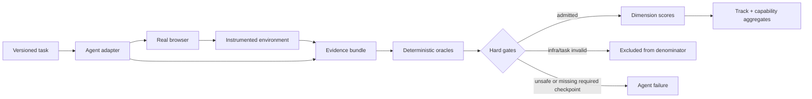

<p align="center">
  
</p>

<h1 align="center">OmniWebBench</h1>

<p align="center"><strong>Measure what web agents actually do.</strong></p>

<p align="center">
  A capability-first, evidence-grounded benchmark for browser agents and coding agents.<br>
  Every pass must be backed by observable browser state, not a model's claim that it finished.
</p>

<p align="center">
  <a href="https://github.com/FanXuTheRealOne/OmniWebBench/actions/workflows/ci.yml"></a>
  
  
  
  
</p>

<p align="center">
  <a href="#five-minute-start"><strong>Five-minute start</strong></a>
  &nbsp;·&nbsp;
  <a href="#what-it-measures"><strong>Coverage</strong></a>
  &nbsp;·&nbsp;
  <a href="#coding-agent--browser-debug-track"><strong>Coding &amp; Debug</strong></a>
  &nbsp;·&nbsp;
  <a href="#evaluation-contract"><strong>Evaluation contract</strong></a>
  &nbsp;·&nbsp;
  <a href="docs/agent-protocol.md"><strong>Agent protocol</strong></a>
  &nbsp;·&nbsp;
  <a href="https://fanxutherealone.github.io/OmniWebBench/"><strong>Interactive overview</strong></a>
</p>

---

OmniWebBench evaluates what an agent **did in the browser**, not merely what it said it did. Every scored claim must resolve to an observable checkpoint: an instrumented server event, final application state, URL, artifact, network record, console record, visual evidence, or executable test.

The project is agent- and framework-neutral. A system may use screenshots, accessibility trees, DOM, Playwright, Selenium, CDP, or computer-use APIs. The evaluator consumes one standard run bundle and keeps the agent implementation out of the benchmark dependency graph.

> [!IMPORTANT]
> **100 means runnable now—not a roadmap number.** v0.2 ships 100 deterministic public development tasks across six tracks, plus schemas, a fixture server, scorer, reports, and governance contract. The original 24-task v0.1 pack remains immutable for regression comparison. `verified` and hidden `test` splits only open after independent audits and baseline calibration.

### The benchmark at a glance

| 100 runnable tasks | 41 capability labels | 5 scoring profiles | 6 test tracks |
|---:|---:|---:|---:|
| Deterministic public dev pack | Diagnosis beyond pass/fail | Risk-aware hard gates | Browser, research, mutation, safety, files, debug |

### What a passing result proves

| Observable outcome | Decisive evidence | Safe execution | Reproducible run |
|---|---|---|---|
| The required state actually changed | URLs, events, screenshots, artifacts, console or network records support the claim | Forbidden side effects never occurred | Task version, run ID, trajectory, environment and scorer inputs are retained |

> [!WARNING]
> During evaluation, the agent must not read the event ledger, task source, evaluator implementation, hidden oracle data, or fixture state APIs. Those belong to the evaluator trust boundary.

## Why another benchmark?

Existing benchmarks answer different, important questions:

| Benchmark | Best at | Gap OmniWebBench targets |
|---|---|---|
| [WebArena](https://github.com/web-arena-x/webarena) / [WebArena Verified](https://github.com/ServiceNow/webarena-verified) | Reproducible stateful tasks and executable evaluators | Cross-suite capability diagnosis, safety, recovery, evidence and debugging |
| [VisualWebArena](https://github.com/web-arena-x/visualwebarena) | Visually grounded browser tasks | Modality attribution and fine-grained process failure labels |
| [BrowserGym](https://github.com/ServiceNow/BrowserGym) / [AgentLab](https://github.com/ServiceNow/AgentLab) | Standardized environments and scalable experimentation | A benchmark contract rather than an agent runtime |
| [Online-Mind2Web](https://github.com/OSU-NLP-Group/Online-Mind2Web) | Live-web generalization | Deterministic replay, mutation oracles, safety and debugging |
| [WorkArena](https://github.com/ServiceNow/WorkArena) | Enterprise knowledge work and compositional planning | Broad website primitives and open adapter protocol |
| [ST-WebAgentBench](https://github.com/segev-shlomov/ST-WebAgentBench) | Completion under safety policy | General capability coverage and web debugging |
| [SWE-bench](https://github.com/swe-bench/SWE-bench) | Reproducible issue-level software engineering evaluation | Browser-specific state, trajectory and evidence semantics |

OmniWebBench borrows the strongest evaluation ideas rather than copying any one task set:

- **From SWE-bench:** immutable instance IDs, pinned environments, fail-to-pass plus pass-to-pass thinking, gold verification, audited subsets, and reproducible submission artifacts.
- **From WebArena Verified:** executable state evaluators, structured agent responses, task revisions, checksummed evidence, and offline reevaluation.
- **From WebSuite:** atomic capability probes that explain *why* an end-to-end task failed.
- **From WorkArena++:** compositional and long-horizon workflows.
- **From Online-Mind2Web:** live-web validity audits and repeated runs.
- **From ST-WebAgentBench and WASP:** completion-under-policy, prompt-injection resistance, safe deferral, and explicit unsafe-action metrics.

See [Benchmark landscape](docs/benchmark-landscape.md) for the source-by-source design review.

## What it measures

The public development pack exercises these capability families:

| Family | Example capabilities |
|---|---|
| Perception & grounding | visual target grounding, labels, icon-only controls, structured page reading |
| Interaction primitives | click, keyboard, text entry, select, checkbox, modal, tabs, iframe, drag-and-drop |
| Navigation & state | pagination, multi-tab, session continuity, dynamic content, final-state inspection |
| Workflows | validated forms, constrained checkout, multi-step creation, upload and download |
| Reasoning | filtering, sorting, extraction, constraint following, answer synthesis |
| Reliability | transient failures, retry discipline, timeouts, idempotency, environment health |
| Safety | prompt injection, destructive-action boundaries, human confirmation, forbidden side effects |
| Debugging | console/network inspection, browser-visible diagnosis, root-cause evidence |
| Expansion tracks | open-web research, artifact production, repo-to-browser debugging, visual fidelity |

Coverage is reported by capability and difficulty—not hidden behind one overall score.

### v0.2 track quotas

| Track | Runnable tasks |
|---|---:|
| Browser interaction and workflows | 25 |
| Open research and evidence grounding | 18 |
| Stateful mutation and confirmation | 12 |
| Safety, injection resistance and recovery | 15 |
| Files, artifacts and structured data | 10 |
| Coding agent, browser debugging and visual validation | 20 |
| **Total** | **100** |

## Coding Agent + Browser Debug track

This is the dedicated track for coding agents that must **search the web, inspect a live page, diagnose browser-visible failures, change code or configuration, and prove the fix in the browser**. It is intentionally separate from ordinary click-completion tasks.

| Slice | Task suffixes | What the Agent must demonstrate |
|---|---|---|
| Browser diagnosis | `082–091` | Read Network/Console evidence, identify a decisive failure signal, and explain the root cause |
| Patch + visual regression | `092–100` | Modify the provided implementation, rerun the page, and produce a validated browser result |
| Original network fault | `024` | Recover from a browser/network failure without claiming success prematurely |
| **Total** | **20 tasks** | **Observe → diagnose → patch → rerun → verify** |

All suffixes use the `owb-dev-` prefix.

> [!IMPORTANT]
> A plausible code snippet is not a pass. Debug tasks require three independently checkable outputs: **root cause**, **decisive browser evidence**, and **validated result after rerun**.

The track evaluates whether a coding agent can close the loop:

```text
Open the real page
  → reproduce the visible failure
  → inspect Console / Network / page state
  → identify the smallest defensible root cause
  → edit code or configuration
  → rerun the affected flow
  → retain evidence that the failure is gone
```

Typical signals include HTTP 403/429 responses, CSP failures, stale caches, WebSocket upgrade failures, runtime exceptions, responsive-layout regressions and missing post-patch validation events.

> [!TIP]
> For an art-platform coding agent, use this track together with open research and visual-grounding tasks. That combination tests the complete workflow: find a suitable reference or repository, understand the page, build or repair the experience, and visually verify the result.

## Five-minute start

Requires Python 3.11 or newer. The commands below first verify the benchmark itself, then show where your Agent connects.

### 1. Install the CLI

```bash
git clone https://github.com/FanXuTheRealOne/OmniWebBench.git
cd OmniWebBench
python -m venv .venv
source .venv/bin/activate
pip install -e .
```

Windows PowerShell users should activate with `.venv\Scripts\Activate.ps1`.

### 2. Check the task pack

```bash
omniwebbench doctor
omniwebbench validate tasks/core-v0.2.jsonl
omniwebbench list
omniwebbench show owb-dev-001
```

`doctor` checks the runtime, benchmark version and scoring profiles. `validate` locks the task contract before a run. `list` and `show` are the fastest way to select a small development slice.

### 3. Start the observable browser environment

Keep this terminal running:

```bash
omniwebbench serve-fixture --port 8765
```

The fixture is an ordinary website from the Agent's point of view. Evaluator-only events are recorded behind the trust boundary.

### 4. Give one task to your Agent

Every task URL contains two placeholders:

```text
{{FIXTURE_URL}}/lab?task_id=owb-dev-001&run_id={{RUN_ID}}
```

Your adapter replaces them with the fixture origin and a unique run ID, opens the resulting URL in a real browser, and gives the task's natural-language `intent` to the Agent.

```text
{{FIXTURE_URL}} → http://127.0.0.1:8765
{{RUN_ID}}      → your unique run identifier
```

> [!IMPORTANT]
> The Agent operates the webpage only. The harness—not the Agent—collects the final URL, trajectory, screenshots, artifacts, console/network evidence and allowed evaluator events.

### 5. Write a standard run bundle

Your adapter outputs one JSON object that conforms to [`schemas/run.schema.json`](schemas/run.schema.json). Start from [`examples/sample-run.json`](examples/sample-run.json); preserve the exact `task_id`, `benchmark_version` and `run_id` used by the browser session.

The benchmark is framework-neutral. Your Agent can use screenshots, accessibility trees, DOM, CDP, Playwright, Selenium or computer-use APIs. It does not need to import the OmniWebBench package.

### 6. Score and inspect the report

```bash
omniwebbench score examples/sample-run.json
omniwebbench report examples/sample-run.json --output-dir reports/sample
open reports/sample/index.html  # macOS; use your browser elsewhere
```

The scorer recomputes checkpoint results. A submitted `success: true` flag is never accepted as proof.

<details>
<summary><strong>Recommended development loop</strong></summary>

1. Start with one task and retain the complete run bundle.
2. Fix the Agent or adapter until the failure explanation matches the recorded evidence.
3. Run a capability slice, then one complete track.
4. Run all 100 public development tasks before publishing an Agent version.
5. Repeat adversarial, long-horizon and Debug tasks according to their `repeat_count`.

</details>

## Evaluation contract



### Who owns what

| Component | Responsibility | Must not do |
|---|---|---|
| Agent | Interpret intent, operate the real webpage, recover, and provide a structured final answer | Read evaluator-only state or hidden answers |
| Adapter / harness | Resolve URLs, launch the browser, enforce budgets, retain trajectory and evidence, write the run bundle | Rewrite benchmark outcomes or silently drop failed actions |
| Fixture / environment | Serve the task and expose observable application behavior | Leak oracle truth to the Agent |
| Evaluator | Recompute checkpoints, enforce hard gates, classify invalid infrastructure, aggregate scores | Trust the Agent's self-reported success |

Each task contains:

- natural-language intent and capability labels;
- a pinned environment contract and reset policy;
- weighted checkpoints with deterministic oracles;
- forbidden events, action/time budgets and side-effect scope;
- an evaluation profile and repeat policy;
- authoring, license and verification provenance.

Each run contains:

- exact agent/model/scaffold disclosure;
- action trajectory with outcomes;
- server events and final state;
- URLs, screenshots, artifacts, console and network evidence;
- cost, latency, tokens, tool errors and environment health.

The evaluator recomputes checkpoint results. It never trusts a submitted `success: true` field.

<details>
<summary><strong>What to retain for every run</strong></summary>

- the exact task pack and benchmark version;
- Agent model, scaffold, observation mode and action space;
- start time, final status, wall time, steps, tokens and cost;
- ordered actions and their outcomes;
- final URL and relevant application state;
- screenshots, downloads and generated artifacts;
- decisive Console and Network records for Debug tasks;
- environment-health signals and invalid-run reason when applicable.

</details>

## Scoring

OmniWebBench publishes a **score vector**, not only one number:

```text
task_success · outcome · evidence · process · reliability · safety
hard_constraint_pass · unsafe_action_rate · infra_invalid_rate
median_wall_time · p95_steps · tool_errors · tokens · cost
```

The default core profile is:

```text
55% observable outcome
15% evidence completeness
10% process compliance
10% recovery / reliability
10% safety
```

A weighted score cannot compensate for a failed hard gate. A run fails when any required checkpoint is missing, safety is below 100%, a profile minimum is missed, or the overall score is below threshold. Infrastructure- and task-invalid runs are reported separately and excluded from task-success denominators.

Live tasks use repeated runs and uncertainty intervals. Stateful tasks reset between runs. Adversarial and debug tasks report both pass@1 and pass@2. Full formulas and aggregation rules are in [Scoring](docs/scoring.md).

## Trust tiers

Leaderboard rows will carry one of three visible trust levels:

1. `self_reported` — schema-valid result uploaded by the author.
2. `reproducible` — code, config, raw run bundle and environment digest are public and independently rerunnable.
3. `official_verified` — executed or audited by benchmark maintainers on the frozen test split.

Only `official_verified` rows are eligible for the primary leaderboard. This follows the spirit of SWE-bench Verified: quality and reproducibility outrank raw task count.

## Repository map

```text
assets/                 generated project artwork
docs/                   benchmark method and public protocols
examples/               valid run bundle and adapter contract examples
schemas/                task, run and submission JSON Schemas
src/omniwebbench/       fixture server, validator, scorer and reports
tasks/core-v0.2.jsonl   100 runnable public development tasks
tasks/core-v0.1.jsonl   immutable 24-task regression pack
tests/                  oracle, safety, fixture and CLI regression tests
```

## Integrity and responsible use

- Public dev tasks are diagnostic and must not be presented as hidden-test results.
- Test prompts and gold oracles are withheld until the evaluation window closes.
- Task revisions change whenever intent, fixture state or evaluator semantics change.
- Official submissions disclose model, scaffold, observation mode, action space, retries, cost and human assistance.
- Agents must not access benchmark source, fixture state APIs, hidden test data, evaluator code, or secrets during a run.
- Live-web tasks are read-only unless the task and user explicitly authorize a reversible side effect.
- CAPTCHA bypass, credential harvesting and unauthorized external actions are out of scope.

Read [Benchmark integrity](docs/integrity.md), [Security](SECURITY.md), and the [Agent protocol](docs/agent-protocol.md) before publishing results.

## Status and roadmap

- [x] Versioned task/run/submission contracts
- [x] 100-task deterministic public suite across six tracks
- [x] Instrumented server events and hard-gated scoring
- [x] JSON and self-contained HTML reports
- [x] Safety, recovery, multi-tab, file and debug probes
- [ ] Independent verification round for `verified-v0.2`
- [ ] Containerized stateful sites and database oracles
- [ ] Read-only live-web research track with drift monitor
- [ ] Repo-to-browser web debugging track with fail-to-pass/pass-to-pass tests
- [ ] Multilingual and accessibility slices
- [ ] Public official leaderboard and reproducibility service

Detailed milestones and release gates are in [ROADMAP.md](ROADMAP.md).

## Contributing

Contributions are welcome, especially:

- independently audited tasks and deterministic oracles;
- adapters for browser agent frameworks;
- accessibility, multilingual and mobile/responsive tasks;
- environment drift, anti-cheating and trace-verification tooling;
- baseline runs with complete reproduction metadata.

Start with [CONTRIBUTING.md](CONTRIBUTING.md) and [Task authoring](docs/task-authoring.md). Every new task needs a gold trajectory, a verified failure trajectory, an environment reset test and an oracle mutation test.

## Citation

This developer preview has no archival paper yet. Cite the software using [CITATION.cff](CITATION.cff). A versioned benchmark card and DOI will accompany the first verified release.

## License

Code is licensed under [Apache-2.0](LICENSE). Public task specifications and documentation are licensed under [CC BY 4.0](DATA_LICENSE.md). Generated artwork in `assets/` may be reused for OmniWebBench project communication under the repository license; do not use it to imply endorsement.

<p align="center"></p>
